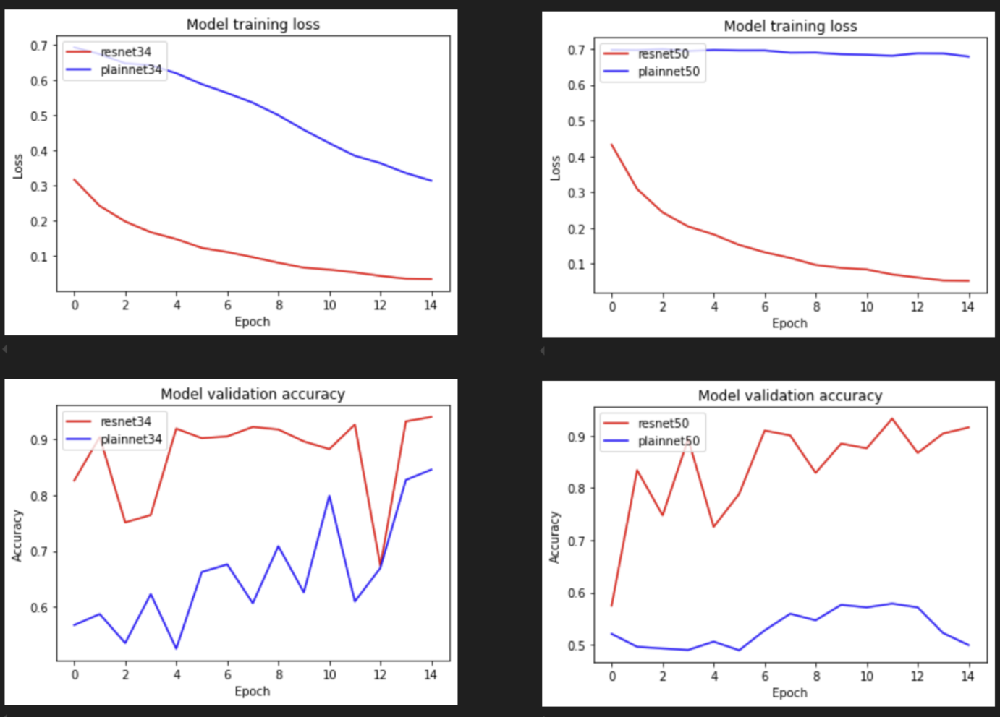
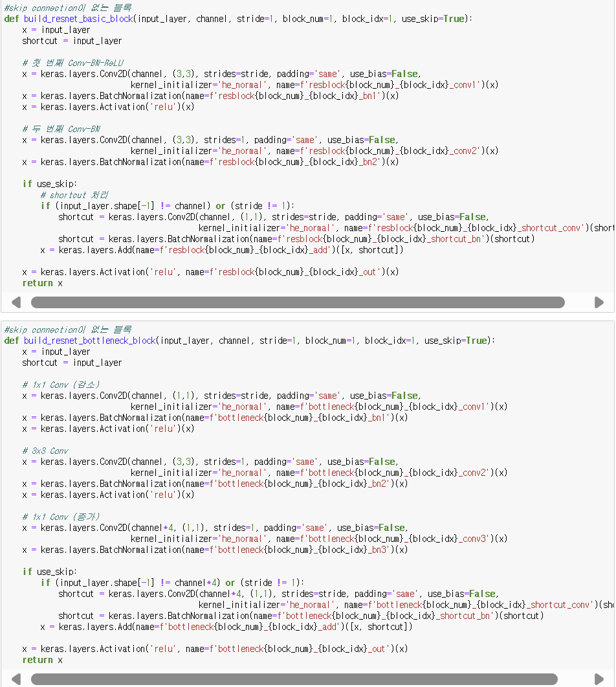
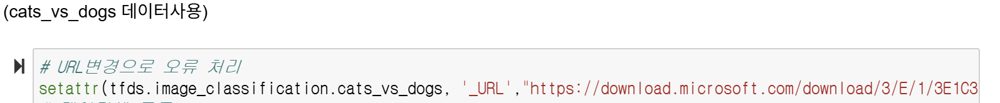
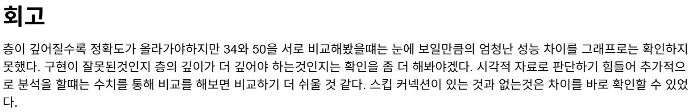
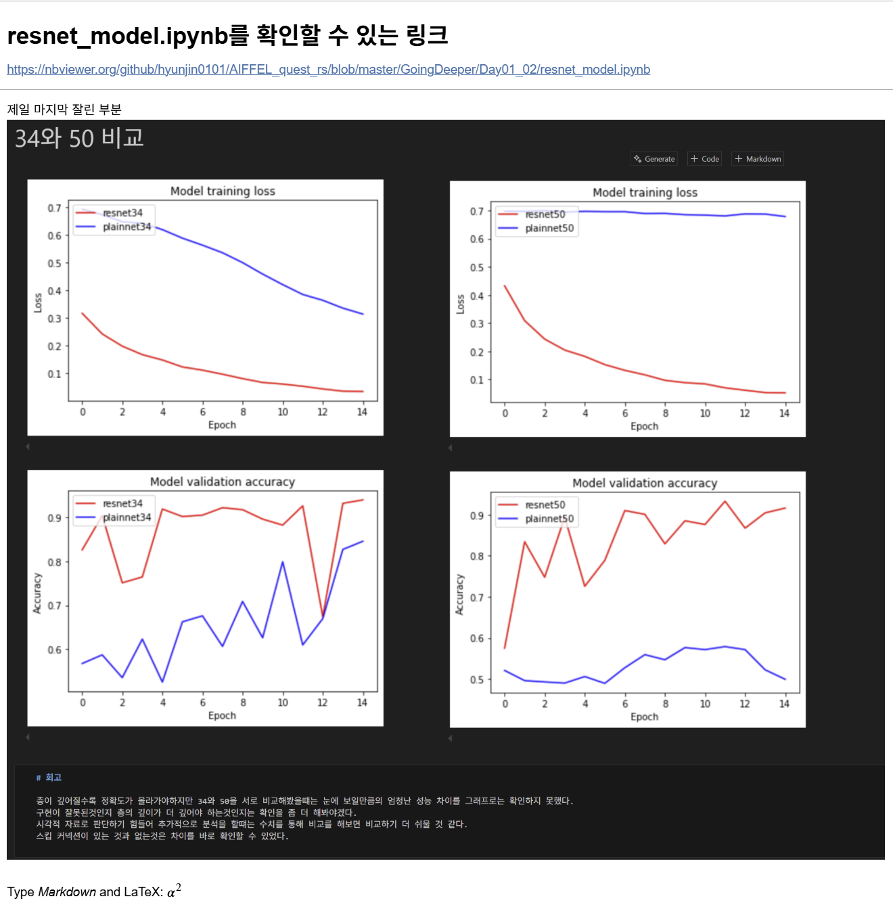

# AIFFEL Campus Online Code Peer Review Templete
- 코더 : 김현진
- 리뷰어 : 김지환


# PRT(Peer Review Template)
- [Ο]  **1. 주어진 문제를 해결하는 완성된 코드가 제출되었나요?**
    - 문제에서 요구하는 최종 결과물이 첨부되었는지 확인
        - 중요! 해당 조건을 만족하는 부분을 캡쳐해 근거로 첨부
        
    
- [Ο]  **2. 전체 코드에서 가장 핵심적이거나 가장 복잡하고 이해하기 어려운 부분에 작성된 
주석 또는 doc string을 보고 해당 코드가 잘 이해되었나요?**
    - 해당 코드 블럭을 왜 핵심적이라고 생각하는지 확인
    - 해당 코드 블럭에 doc string/annotation이 달려 있는지 확인
    - 해당 코드의 기능, 존재 이유, 작동 원리 등을 기술했는지 확인
    - 주석을 보고 코드 이해가 잘 되었는지 확인
        - 중요! 잘 작성되었다고 생각되는 부분을 캡쳐해 근거로 첨부
        
        >VGGNet과 동일한 형식으로 use_skip=True를 통해 skip connection의 유무를 둠
        
- [Ο]  **3. 에러가 난 부분을 디버깅하여 문제를 해결한 기록을 남겼거나
새로운 시도 또는 추가 실험을 수행해봤나요?**
    - 문제 원인 및 해결 과정을 잘 기록하였는지 확인
    - 프로젝트 평가 기준에 더해 추가적으로 수행한 나만의 시도, 
    실험이 기록되어 있는지 확인
        - 중요! 잘 작성되었다고 생각되는 부분을 캡쳐해 근거로 첨부
        
        >Tensorflow에서 api내에 제공되어있는 링크를 데이터를 로드하기 전, 새 링크를 반영해 교체한 후 업데이트를 진행
        >프로젝트 노드에서 도움 사항을 잘 참고하심
        
- [Ο]  **4. 회고를 잘 작성했나요?**
    - 주어진 문제를 해결하는 완성된 코드 내지 프로젝트 결과물에 대해
    배운점과 아쉬운점, 느낀점 등이 기록되어 있는지 확인
    - 전체 코드 실행 플로우를 그래프로 그려서 이해를 돕고 있는지 확인
        - 중요! 잘 작성되었다고 생각되는 부분을 캡쳐해 근거로 첨부
        
        
- [Ο]  **5. 코드가 간결하고 효율적인가요?**
    - 파이썬 스타일 가이드 (PEP8) 를 준수하였는지 확인
    - 코드 중복을 최소화하고 범용적으로 사용할 수 있도록 함수화/모듈화했는지 확인
        - 중요! 잘 작성되었다고 생각되는 부분을 캡쳐해 근거로 첨부
        >코드에 대한 주석이 과하지도 않고 부족하지도 않아서 간결하고 깔끔해 공유하는 (보여주는) 코드로서는 최고 같다.
        
        >GitHub에서 노트북 파일을 확인하는데 원활하게 보이지 않는 문제가 있어 이를 해결하려 함


# 회고(참고 링크 및 코드 개선)
```
# 전반적으로 프로젝트를 꼼꼼하게 진행하심
# 5. 링크 : https://nbviewer.org/github/hyunjin0101/AIFFEL_quest_rs/blob/master/GoingDeeper/Day01_02/resnet_model.ipynb
```
